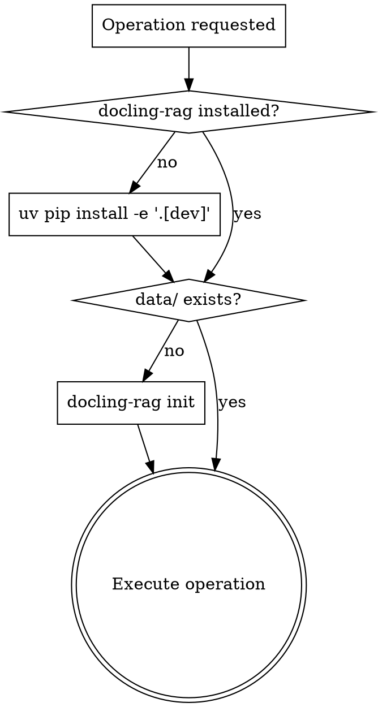

# docling-rag Manager

## Overview

Full management of docling-rag CLI: install, initialize, index documents, semantic search, list indexed docs. Always check prerequisites before operating. Use `docling-rag list` (not raw JSON files) to inspect index state.

## Prerequisites Check



Check install: `docling-rag --help`
Check init: `ls data/` (directory must exist — empty is OK after init, populated after add)

## Operations

### Bootstrap

```bash
uv pip install -e ".[dev]"   # install from project root
docling-rag init              # creates data/ and logs/
```

### Index Documents (add)

```bash
# Single file
docling-rag add path/to/file.pdf

# Directory (recursive — indexes all supported files)
docling-rag add path/to/docs/

# With metadata (all optional)
docling-rag add file.pdf --title "My Doc" --topic "data vault" --tag arch --tag solid
```

Supported formats: **PDF, DOCX, MD only**. Docling does NOT parse `.txt` files.

### Search

```bash
docling-rag search "your query"

# With filters (AND logic for multiple --tag)
docling-rag search "query" --tag arch --topic "data vault" --top-k 10
```

`--topic` comparison is case-insensitive. If filter matches zero docs → empty results (no fallback to all docs).

### Ask (Agent Mode)

Requires: `uv pip install -e ".[agent]"` + `agent_enabled: true` in `config.yaml` + LM Studio running.

```bash
# Ask a question (agent uses search tool, LLM synthesizes answer)
docling-rag ask "What is Data Vault?"
docling-rag ask "Explain hub tables" --top-k 10
```

Agent uses local LLM via LM Studio (`http://127.0.0.1:1234/v1`). 100% offline.

### List Indexed Documents

```bash
docling-rag list
```

Shows all documents with chunk count, title, topic, and tags. This is the canonical way to inspect index state — do not read `data/doc_index.json` or `data/metadata.json` directly.

## Quick Reference

| Command | Accepts | Key flags |
|---------|---------|-----------|
| `init` | `--data-dir`, `--config` | `docling-rag init` |
| `add` | `--data-dir`, `--config`, `--title`, `--topic`, `--tag` (repeatable) | `docling-rag add docs/ --tag arch` |
| `search` | `--data-dir`, `--config`, `--top-k`, `--tag` (repeatable), `--topic` | `docling-rag search "hub tables"` |
| `ask` | `--data-dir`, `--config`, `--top-k` | `docling-rag ask "question"` |
| `list` | `--data-dir` **only** | `docling-rag list` |

## Common Mistakes

- `.txt` files silently fail — Docling only supports PDF, DOCX, MD
- `list` does NOT accept `--config` (only `--data-dir`)
- `--tag` is repeatable: `--tag arch --tag solid` not `--tag "arch, solid"`
- Changing embedding model requires full re-indexing (delete `data/` and re-add)
- Always run `init` before first `add` — `data/` must exist
- Empty `--tag`/`--topic` filter match → empty results, not fallback to all docs
- `ask` requires `agent_enabled: true` in config.yaml — disabled by default
- `ask` requires pydantic-ai installed: `uv pip install -e ".[agent]"`
- `ask` requires LM Studio running on configured `llm_base_url`
