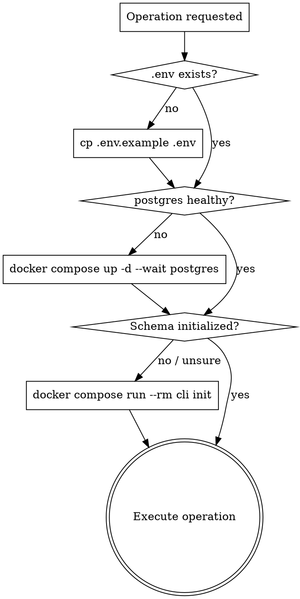

# docling-rag Manager

## Overview

Full management of docling-rag: init schema, index documents, semantic search, list, delete, ask.

**The CLI is docker-only** — the index lives in PostgreSQL + pgvector, so every command runs as
`docker compose run --rm cli <command>`. A host install (`uv pip install -e ".[dev]"`) exists only
for running tests. Use `docker compose run --rm cli list` (not raw SQL) to inspect index state.

## Prerequisites Check


```dot
digraph prereq {
    "Operation requested" [shape=box];
    ".env exists?" [shape=diamond];
    "Copy env" [shape=box, label="cp .env.example .env"];
    "postgres healthy?" [shape=diamond];
    "Up" [shape=box, label="docker compose up -d --wait postgres"];
    "Schema initialized?" [shape=diamond];
    "Init" [shape=box, label="docker compose run --rm cli init"];
    "Execute operation" [shape=doublecircle];

    "Operation requested" -> ".env exists?";
    ".env exists?" -> "Copy env" [label="no"];
    ".env exists?" -> "postgres healthy?" [label="yes"];
    "Copy env" -> "postgres healthy?";
    "postgres healthy?" -> "Up" [label="no"];
    "postgres healthy?" -> "Schema initialized?" [label="yes"];
    "Up" -> "Schema initialized?";
    "Schema initialized?" -> "Init" [label="no / unsure"];
    "Schema initialized?" -> "Execute operation" [label="yes"];
    "Init" -> "Execute operation";
}
```

Check postgres: `docker compose ps postgres` (must be healthy).
Check schema: any command failing with «Схема БД не инициализирована» means run `init` — it is
idempotent, so running it when unsure is safe and cheap.

## Operations

### Bootstrap

```bash
cp .env.example .env                  # host paths for volumes + ports
docker compose up -d --wait           # postgres + api
docker compose run --rm cli init      # DDL: pgvector extension, tables, HNSW index (idempotent)
```

### Index Documents (add)

Documents must live under `${BOOKS_DIR:-./books}` on the host — the container sees them as `/books`.

```bash
# Single file
docker compose run --rm cli add /books/file.pdf

# Directory (recursive — indexes all supported files)
docker compose run --rm cli add /books/subdir/

# With metadata (all optional)
docker compose run --rm cli add /books/file.pdf --title "My Doc" --topic "data vault" --tag arch --tag solid

# With OCR tuning (for scanned PDFs)
docker compose run --rm cli add /books/scan.pdf --ocr on --ocr-lang ru
```

**OCR flags** (optional, PDF only):
- `--ocr [auto|on|off]` — режим OCR (дефолт: auto = детект текстового слоя: цифровой PDF → off, скан → on)
- `--ocr-lang [en|ru]` — язык OCR для сканов (дефолт: en; ru = кириллическая модель RapidOCR)

Supported formats: **PDF, DOCX, MD only**. Docling does NOT parse `.txt` files.

Re-adding the same file is idempotent — chunks are replaced, `added_at` and existing
title/topic/tags are preserved.

The first `add` downloads the embedding model `deepvk/USER-bge-m3` (~2.3 GB) into
`${HF_CACHE_DIR}`; indexing on CPU is slow (minutes for a large PDF). This is expected — do not
kill the command assuming it hung.

### Search

```bash
docker compose run --rm cli search "your query"

# With filters (AND logic for multiple --tag)
docker compose run --rm cli search "query" --tag arch --topic "data vault" --top-k 10
```

`--topic` comparison is case-insensitive. If filter matches zero docs → empty results (no fallback to all docs).

### Ask (Agent Mode)

Requires LM Studio running on the **host** at port 1234 (the container reaches it via
`host.docker.internal:1234`). Agent is already enabled in the container config.

```bash
docker compose run --rm cli ask "What is Data Vault?"
docker compose run --rm cli ask "Explain hub tables" --top-k 10
```

100% offline — local LLM only.

### List Indexed Documents

```bash
docker compose run --rm cli list
```

Shows all documents with chunk count, title, topic, and tags. This is the canonical way to inspect
index state — do not query postgres directly. Empty index prints «Хранилище пустое. Документов нет.»
and exits 0.

### Delete a Document

```bash
docker compose run --rm cli delete /books/file.pdf
```

Removes the document and all its chunks (cascade). The argument is the source path exactly as
`list` shows it. Deleting a document that is not indexed exits 1 with «Документ не найден».

## Quick Reference

Every command also accepts `--config PATH`.

| Command | Flags | Example |
|---------|-------|---------|
| `init` | — | `docker compose run --rm cli init` |
| `add` | `--title`, `--topic`, `--tag` (repeatable), `--ocr`, `--ocr-lang` | `docker compose run --rm cli add /books/ --tag arch` |
| `search` | `--top-k`, `--tag` (repeatable), `--topic` | `docker compose run --rm cli search "hub tables"` |
| `list` | — | `docker compose run --rm cli list` |
| `delete` | — | `docker compose run --rm cli delete /books/x.pdf` |
| `ask` | `--top-k` | `docker compose run --rm cli ask "question"` |

## Common Mistakes

- Running `docling-rag` on the host — it needs postgres; use `docker compose run --rm cli ...`
- `--data-dir` no longer exists (file storage was removed) — the DSN comes from `DATABASE_URL` / `database_url`
- Passing a host path to `add` — inside the container the file must be under `/books`
- `.txt` files silently fail — Docling only supports PDF, DOCX, MD
- `--tag` is repeatable: `--tag arch --tag solid` not `--tag "arch, solid"`
- Changing `embedding_model` requires full re-indexing AND a DDL change — the vector column is
  `vector(1024)`, pinned to USER-bge-m3
- «PostgreSQL недоступен» → `docker compose up -d --wait postgres`; «Схема БД не инициализирована» → `cli init`
- Empty `--tag`/`--topic` filter match → empty results, not fallback to all docs
- `ask` requires LM Studio running on the host at `llm_base_url`
